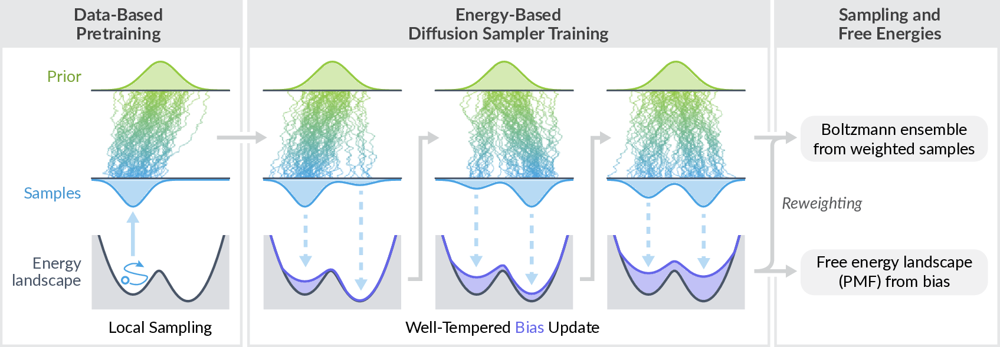

<h1 align="center">Well-Tempered Adjoint Schrödinger Bridge Sampler</h1>

A PyTorch implementation of the **Well-Tempered Adjoint Schrödinger Bridge Sampler (WT-ASBS)**, which enhances diffusion-based sampling of chemical systems by introducing a sequential bias along low-dimensional projections of atomic coordinates (collective variables).

📄 Preprint: [Enhancing Diffusion-Based Sampling with Molecular Collective Variables](https://arxiv.org/abs/2510.11923)



Note: This codebase started as a fork of the [adjoint_samplers](https://github.com/facebookresearch/adjoint_samplers) repository, with modifications to support the `fairchem` data format and the well-tempered bias mechanism.

## Installation

We recommend using [uv](https://docs.astral.sh/uv/) to install the dependencies.
After cloning the repository, run the following command to install the dependencies:

```bash
git clone https://github.com/facebookresearch/wt-asbs.git && cd wt-asbs
uv sync
```

Alternatively, you can use the pip install command:
```bash
pip install -e .

# Optional: install the development dependencies
pip install -e ".[dev]"
prek install
```

For metadynamics simulations, [PLUMED](https://www.plumed.org) and [OpenMM-PLUMED](https://github.com/openmm/openmm-plumed) have to be additionally installed.
Please refer to their documentation for installation instructions.

### huggingface

For the reactive sampling experiments, you need to apply for model access to the [UMA model repository](https://huggingface.co/facebook/UMA), and log in to the Hugging Face CLI using an access token. This requires installing the [huggingface cli](https://huggingface.co/docs/huggingface_hub/en/guides/cli).

```bash
hf login
```

#### Pretrain data

MD and well-tempered metadynamics simulation scripts and pretraining data are hosted on [Hugging Face](https://huggingface.co/facebook/wt-asbs).
We provide a script to download the files to local directory `md_data/`.
Downloading data requires you to have a [token](https://huggingface.co/settings/tokens).
You must first [apply for access to the repo](https://huggingface.co/facebook/wt-asbs) before downloading and logged into the [huggingface-cli](https://huggingface.co/docs/huggingface_hub/en/guides/cli).

```bash
python scripts/download_pretraining_data.py
```

#### Reference data and models
We've also provided reference metadynamics, pretrained models, and example model outputs on [Hugging Face](https://huggingface.co/facebook/wt-asbs). 

## Training

Logging is handled by [Weights & Biases](https://wandb.ai), and you need to create an account and get an API key.
You can set the `WANDB_API_KEY` environment variable or use the `wandb login` command to save the key.

We provide an example script for alanine dipeptide training and sampling in the `scripts/ala2.sh` file.
We assume that the script is run in the root directory of the repository.
Configuration files for all systems are provided in the `src/wt_asbs/config/experiment` directory, and you can modify `experiment` input argument to run the training for different systems.

Currently, all configurations are set for 8 GPUs.
To use a different number of GPUs, override the `fabric.devices` input argument.
Also, note that `{train,inference}_batch_size`, `{adjoint,corrector}_buffer.max_size`, `initial_buffer_samples`, and `buffer_samples_per_epoch` are defined as per-GPU values, so you need to multiply them by the number of GPUs to get the total values.

Trained checkpoints and samples are also available on [Hugging Face](https://huggingface.co/facebook/wt-asbs).

### 1. Pretraining

Pretraining saves the checkpoints in `{root}/{name}/checkpoints/`, and the intermediate samples in `{root}/{name}/samples/`.

```bash
python -u -m wt_asbs.experiment.pretrain_bm \
    root=ckpts \
    experiment=ala2 \
    name=ala2_pretrain
```

### 2. WT-ASBS training

Similarly, WT-ASBS training saves the checkpoints in `{root}/{name}/checkpoints/`, and the intermediate samples in `{root}/{name}/samples/`.
We need to provide the pretrained controller checkpoint from the pretraining step to the `pretrained_controller_checkpoint` input argument.

```bash
python -u -m wt_asbs.experiment.train_asbs \
    root=ckpts \
    experiment=ala2 \
    name=ala2_wt_asbs \
    pretrained_controller_checkpoint=ckpts/ala2_pretrain/checkpoints/epoch_1000.pt
```

For example, intermediate bias values (for on-the-fly PMF calculation) can be retrieved from the checkpoint as follows:

```python
ckpt = torch.load("ckpts/ala2_wt_asbs/checkpoints/epoch_1000.pt", weights_only=False)
bias_values = ckpt["metadynamics_bias"]["bias_grid.bias_values"]
meshgrid = ckpt["metadynamics_bias"]["bias_grid.meshgrid"]
```

### 3. Sampling from the final checkpoint

Sampling from the final checkpoint saves the samples to the `{root}/{name}/samples.pt` file, which contains a dictionary with the following keys:
- `pos`: (num_samples, num_atoms, 3) array of atomic positions, in units of Å
- `cv`: (num_samples, num_cvs) array of collective variables
- `bias`: (num_samples,) array of bias values for each sample for reweighting, in units of eV

```bash
python -u -m wt_asbs.experiment.inference \
    checkpoint_directory=ckpts/ala2_wt_asbs \
    num_samples=1000000
```

## 📚 Citation

If you find this code useful in your research or projects, please consider citing our paper:

```bibtex
@misc{nam2025enhancing,
  title={Enhancing Diffusion-Based Sampling with Molecular Collective Variables},
  author={Juno Nam and Bálint Máté and Artur P. Toshev and Manasa Kaniselvan and Rafael Gómez-Bombarelli and Ricky T. Q. Chen and Brandon Wood and Guan-Horng Liu and Benjamin Kurt Miller},
  year={2025},
  eprint={2510.11923},
  archivePrefix={arXiv},
  primaryClass={physics.chem-ph},
  url={https://arxiv.org/abs/2510.11923},
}
```

## License

`wt-asbs` code, model, and checkpoints are licensed under the [FAIR Chem License](LICENSE). Data is licensed under CC-BY-4.0. Dependencies have their own licences.
